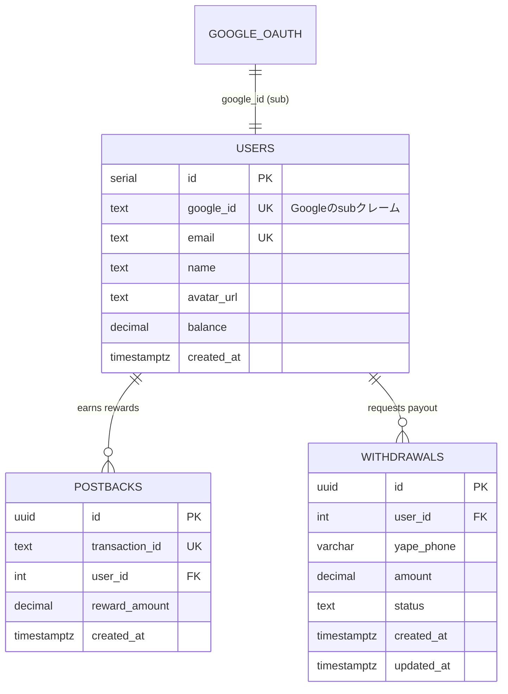

# データ構造・DBスキーマ

Monlix iframeにタスク一覧・タスク詳細・外部サイト誘導・成果判定を任せるため、自アプリ側でタスク（案件）テーブルは持たない。管理するのは以下の3テーブルのみ。DBは**Heroku Postgres**。

| テーブル | 役割 | 主な利用画面・処理 |
| --- | --- | --- |
| `users` | ユーザー情報と現在残高を管理する | Home / Wallet |
| `postbacks` | Monlixから届いた成果発生履歴を保存する（`transaction_id` で二重付与を防止） | Webhook / Wallet履歴 |
| `withdrawals` | Yape換金申請と送金ステータス（pending/completed/rejected）を管理する | Wallet / DBクライアント（管理者） |

## ER図

FarmMatchと同じく、`users.id` は連番の整数、Googleアカウントとの紐付けは `google_id` カラム（GoogleのIDトークンの `sub` クレーム）で行う。



## DDL（Heroku Postgres）

金額の計算ズレを防ぐため、金額カラムには `DECIMAL(10, 2)` を使う。フロントエンドはDBに直接アクセスしないため、RLSは不要（アクセス制御はFastAPI側で行う）。

```sql
CREATE TABLE users (
  id SERIAL PRIMARY KEY,
  google_id TEXT UNIQUE NOT NULL,                -- GoogleのIDトークンのsubクレーム
  email TEXT UNIQUE NOT NULL,
  name TEXT,                                     -- Googleの表示名
  avatar_url TEXT,                               -- Googleのアイコン画像URL
  balance DECIMAL(10, 2) NOT NULL DEFAULT 0.00,  -- 現在の所持ソル(S/)
  created_at TIMESTAMPTZ DEFAULT NOW()
);

CREATE TABLE postbacks (
  id UUID PRIMARY KEY DEFAULT gen_random_uuid(),
  transaction_id TEXT UNIQUE NOT NULL,           -- Monlixの一意の取引ID（二重付与を防止）
  user_id INTEGER NOT NULL REFERENCES users(id),
  reward_amount DECIMAL(10, 2) NOT NULL,         -- 付与されたソル(S/)
  created_at TIMESTAMPTZ DEFAULT NOW()
);

CREATE TABLE withdrawals (
  id UUID PRIMARY KEY DEFAULT gen_random_uuid(),
  user_id INTEGER NOT NULL REFERENCES users(id),
  yape_phone VARCHAR(9) NOT NULL,                -- ペルーの電話番号（9桁）
  amount DECIMAL(10, 2) NOT NULL,                -- 申請金額(S/)
  status TEXT NOT NULL DEFAULT 'pending' CHECK (
    status IN ('pending', 'completed', 'rejected')
  ),
  created_at TIMESTAMPTZ DEFAULT NOW(),
  updated_at TIMESTAMPTZ DEFAULT NOW()
);
```

マイグレーションはFarmMatchと同じく**Alembic**で管理する（導入済み: `server/alembic/`）。スキーマの正はSQLModelモデル＋マイグレーションであり、上記DDLは参考情報。

## usersの行作成（プロビジョニング）

NextAuthでのGoogleログイン後、フロントエンドがGoogleのIDトークンを `POST /api/v1/auth/login` に送る。FastAPIがトークンを検証し、`sub` / `email` / `name` / `picture` を使って `users` 行をUPSERTしてから自前JWTを返す。詳細は [05-api-design.md](./05-api-design.md) を参照。

## Webhook / Postback処理フロー

```
Monlix
  ↓ Postback / Webhook
FastAPI (Heroku)
  ↓ transaction_id 重複チェック
postbacks に保存
  ↓
users.balance を加算
  ↓
Home / Wallet に残高反映（フロントはAPIから取得）
```

## 換金申請の運用フロー

1. ユーザーがWalletからYape番号・金額を入力して申請
2. FastAPIが**残高チェックと差し引きを1トランザクションで行い**、`withdrawals` に `pending` として保存（残高は申請時に差し引く。二重申請防止のため `pending` は同時に1件まで）
3. 管理者が **DBクライアント（TablePlus / pgAdmin等）** でHeroku Postgresに接続し `pending` を確認
4. Yapeで手動送金
5. `status` を `completed` に更新 → Wallet側の履歴表示が「送金完了」に変わる
6. 却下する場合は `rejected` に更新し、差し引いた金額を `users.balance` に手動SQLで戻す（詳細は [05-api-design.md](./05-api-design.md)）

## MVPで不要と判断されたもの

- `tasks` / `campaigns` / `task_details` テーブル
- タスク詳細画面 `/tasks/:taskId`
- 案件一覧API・案件詳細API
- 自作Admin画面（DBクライアントで代替）
- RLS（フロントエンドがDBに直接アクセスしないため）
