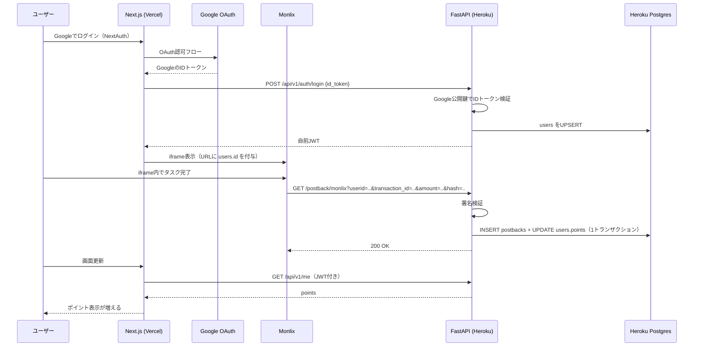
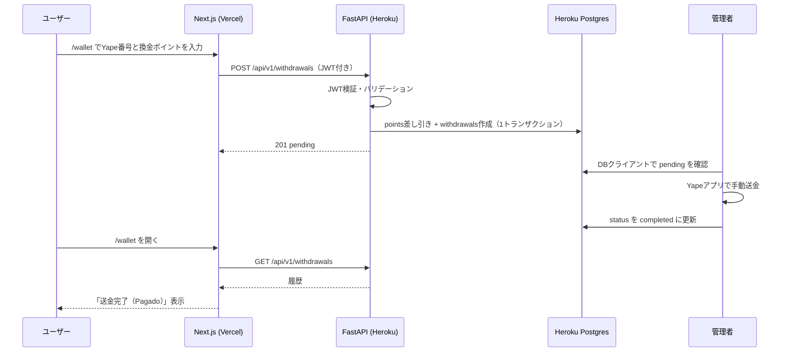

# API設計（FastAPI on Heroku）

## 設計の基本方針

フロントエンドはDBに直接アクセスしない。**読み取りも書き込みもすべてFastAPI経由**で行い、お金が動く処理はDBトランザクションで守る。

| 操作 | 経路 | 備考 |
| --- | --- | --- |
| ログイン | NextAuth（Google）→ FastAPI `/auth/login` → 自前JWT発行 | FarmMatchパターン |
| ポイント・換金履歴の表示 | フロントエンド → FastAPI → Heroku Postgres | 自前JWTで本人確認し、自分のデータだけ返す |
| 報酬付与（Postback） | Monlix → FastAPI → Heroku Postgres | 二重付与防止・署名検証はサーバー側で実施 |
| 換金申請 | フロントエンド → FastAPI → Heroku Postgres | ポイントチェックと差し引きをアトミックに行う |
| 換金処理（送金完了・却下） | 管理者がDBクライアント（TablePlus / pgAdmin）で直接更新 | Admin画面を自作しない方針のため |

## 認証（FarmMatchパターン + IDトークン検証）

1. フロントエンドでNextAuth.js（Google Provider）がGoogleログインを処理する
2. NextAuthのコールバックで得た**GoogleのIDトークン**（`account.id_token`）を `POST /api/v1/auth/login` に送る
3. FastAPIはGoogleの公開鍵でIDトークンを検証し（`google-auth` ライブラリ、audience = 自分のGOOGLE_CLIENT_ID）、`sub` / `email` / `name` / `picture` を取り出す
4. `users` をUPSERTし、**自前JWT**（jose / HS256、`sub` = users.id）を発行して返す
5. フロントエンドはNextAuthのセッションに自前JWTを保持し、以降のAPI呼び出しに `Authorization: Bearer <jwt>` を付ける

> FarmMatchとの差分: FarmMatchはフロントから送られたGoogleプロフィールをそのまま信頼していたが、本アプリはお金を扱うため**IDトークンのサーバー側検証を必須**にする。`auth_service.py`（JWT発行・検証）はそのまま流用できる。

- JWTの有効期限は `ACCESS_TOKEN_EXPIRE_MINUTES` で設定（MVPは7日 = 10080分。期限切れ時はNextAuthセッションが生きていれば自動で `/auth/login` を再実行して再取得）
- Postbackエンドポイントのみ認証方式が異なる（後述のシークレット検証）

## エンドポイント一覧

| メソッド | パス | 認証 | 用途 |
| --- | --- | --- | --- |
| GET | `/health` | なし | Herokuのヘルスチェック |
| POST | `/api/v1/auth/login` | GoogleのIDトークン | ユーザーのUPSERTと自前JWTの発行 |
| GET | `/api/v1/me` | 自前JWT | 自分のプロフィール・所持ポイント取得 |
| GET | `/api/v1/withdrawals` | 自前JWT | 自分の換金申請履歴の取得 |
| POST | `/api/v1/withdrawals` | 自前JWT | 換金申請の作成 |
| GET | `/postback/monlix` | Postbackシークレット | Monlixからの成果通知受信 |

---

### POST `/api/v1/auth/login` — ログイン・ユーザー登録

**リクエスト**

```json
{
  "id_token": "eyJhbGciOiJSUzI1NiIs..."
}
```

**処理**

1. GoogleのIDトークンを検証（署名・有効期限・audience）
2. `google_id`（= `sub`）で `users` をUPSERT:

```sql
INSERT INTO users (google_id, email, name, avatar_url)
VALUES (:sub, :email, :name, :picture)
ON CONFLICT (google_id) DO UPDATE SET name = EXCLUDED.name, avatar_url = EXCLUDED.avatar_url;
```

3. 自前JWTを発行して返す

**レスポンス（200）**

```json
{
  "access_token": "eyJhbGciOiJIUzI1NiIs...",
  "token_type": "bearer"
}
```

| 失敗 | ステータス |
| --- | --- |
| IDトークンが不正・期限切れ | 401 `INVALID_GOOGLE_TOKEN` |

---

### GET `/api/v1/me` — 自分の情報と所持ポイント

Home画面のヘッダー（所持ポイント・プログレスバー）とWallet画面のポイント表示に使う。

**レスポンス（200）**

```json
{
  "id": 123,
  "email": "user@example.com",
  "name": "Juan Pérez",
  "avatar_url": "https://...",
  "points": 250,
  "min_withdrawal_points": 500,
  "points_per_sol": 100
}
```

`min_withdrawal_points` と `points_per_sol` を含めるのは、フロントエンドがプログレスバー・申請ボタンの活性制御・ソル換算プレビューに使うため（値をフロントにハードコードしない）。

---

### GET `/api/v1/withdrawals` — 換金申請履歴

Wallet画面の履歴一覧に使う。自分の申請のみ、作成日時の降順で返す。

**レスポンス（200）**

```json
{
  "withdrawals": [
    {
      "id": "b7e2...",
      "yape_phone": "987654321",
      "points": 1000,
      "amount_soles": "10.00",
      "status": "pending",
      "created_at": "2026-07-22T10:00:00Z"
    }
  ]
}
```

---

### POST `/api/v1/withdrawals` — 換金申請の作成

**リクエスト**

```json
{
  "yape_phone": "987654321",
  "points": 1000
}
```

**バリデーション**

| ルール | 失敗時 |
| --- | --- |
| `yape_phone` は9桁の数字で `9` 始まり（ペルーの携帯番号形式） | 422 `INVALID_PHONE` |
| `points >= 500`（最低換金ポイント = S/ 5相当） | 422 `BELOW_MINIMUM` |
| `points` が `POINTS_PER_SOL`（100）の倍数（端数ソルを発生させない） | 422 `INVALID_AMOUNT` |
| `points <= users.points` | 422 `INSUFFICIENT_POINTS` |
| 同一ユーザーの `pending` 申請が存在しない | 409 `WITHDRAWAL_ALREADY_PENDING` |

**処理**（1トランザクションで実行。ポイントは**申請時に差し引く**。`amount_soles = points / POINTS_PER_SOL`）

```
BEGIN;
SELECT points FROM users WHERE id = :user_id FOR UPDATE;  -- 行ロックで並行申請を防ぐ
-- ポイントチェック
UPDATE users SET points = points - :points WHERE id = :user_id;
INSERT INTO withdrawals (user_id, yape_phone, points, amount_soles, status)
  VALUES (..., 'pending');
COMMIT;
```

**レスポンス（201）**

```json
{
  "id": "b7e2...",
  "yape_phone": "987654321",
  "points": 1000,
  "amount_soles": "10.00",
  "status": "pending",
  "created_at": "2026-07-22T10:00:00Z"
}
```

---

### GET `/postback/monlix` — 成果通知の受信

Monlixが成果発生時に呼び出すサーバー間通信。MonlixのPostbackはクエリパラメータ付きGETリクエスト。

**クエリパラメータ**（Monlix管理画面のPostback URL設定でマクロを割り当てる）

| パラメータ | 例 | 説明 |
| --- | --- | --- |
| `userid` | `123` | 成果を上げたユーザーのID（`users.id`）。iframe埋め込み時に渡した値がそのまま返る |
| `transaction_id` | `mlx_abc123` | Monlix側の一意の取引ID。冪等性キー |
| `amount` | `500` | ユーザーに付与するポイント数（整数。Monlixダッシュボードの仮想通貨単位） |
| `status` | `1` | 成果の状態（承認 = 1） |
| `hash` | `a3f9...` | 署名（下記の検証方法参照） |

**検証（正当性チェック）** — 上から順に実施し、失敗したら付与しない

1. **署名検証**: Monlixが提供するSecret Keyを使ったハッシュ（`hash`パラメータ）を検証する。方式はMonlixのPostback仕様に従う（契約後に確定）
2. **IP制限（任意）**: Monlixが公開するPostback送信元IPをホワイトリスト化できる場合は併用する
3. **`userid` の存在チェック**: `users` に該当行がなければ404
4. **`transaction_id` の重複チェック**: `postbacks.transaction_id` のUNIQUE制約により、INSERT時の一意性違反で検出する

**処理**（1トランザクションで実行）

```
BEGIN;
INSERT INTO postbacks (transaction_id, user_id, reward_points) VALUES (...);
  -- UNIQUE違反なら → ロールバックし 200 を返す（Monlixに再送させない）
UPDATE users SET points = points + :points WHERE id = :userid;
COMMIT;
```

**レスポンス**

| 状況 | ステータス | 備考 |
| --- | --- | --- |
| 付与成功 | 200 | ボディは `OK` などMonlix仕様に従う |
| transaction_id重複（再送） | 200 | 冪等。すでに処理済みなので成功として返し再送を止める |
| 署名不正 | 403 | 付与しない。ログに記録 |
| userid不明 | 404 | 付与しない。ログに記録 |

---

### エラーレスポンス共通形式

```json
{
  "error": {
    "code": "INSUFFICIENT_POINTS",
    "message": "Puntos insuficientes"
  }
}
```

`message` はユーザー表示用にスペイン語。`code` はフロントエンドの分岐用。

## 換金申請のライフサイクルとポイントの動き

```
申請時:    points から消費ポイントを差し引き、withdrawals に pending で保存
completed: 管理者がYape送金後、DBクライアントで status を completed に変更（ポイント操作なし）
rejected:  管理者がDBクライアントで status を rejected に変更し、
           あわせて points を戻すSQLを実行（返還）
```

rejected時の返還SQL（DBクライアントから実行）:

```sql
BEGIN;
UPDATE withdrawals SET status = 'rejected', updated_at = NOW() WHERE id = :withdrawal_id;
UPDATE users SET points = points + :points WHERE id = :user_id;
COMMIT;
```

> ⚠️ MVPでは手動運用。件数が増えたらDBトリガー（`status` が `rejected` に変わったら自動返還）に置き換える。

ポイントを申請時に差し引く理由: 差し引かないと、`pending` 中にポイントを使い回して二重申請できてしまう。「pending申請は1件まで」の制約と合わせて二重出金を防ぐ。

## シーケンス図

### ログイン〜報酬付与フロー



### 換金申請フロー



## 環境変数

### バックエンド（FastAPI / Heroku）

| 変数名 | 内容 |
| --- | --- |
| `DATABASE_URL` | Heroku Postgresの接続文字列（Herokuがアドオン追加時に自動設定） |
| `SECRET_KEY` | 自前JWTの署名鍵（FarmMatchの `auth_service.py` と同じ） |
| `ACCESS_TOKEN_EXPIRE_MINUTES` | JWTの有効期限（分）。MVPは `10080`（7日） |
| `GOOGLE_CLIENT_ID` | GoogleのIDトークン検証時のaudienceチェック用 |
| `MONLIX_POSTBACK_SECRET` | Postback署名検証用（Monlix契約後に取得） |
| `POINTS_PER_SOL` | 換金レート。デフォルト `100`（100 pts = S/ 1） |
| `MIN_WITHDRAWAL_POINTS` | 最低換金ポイント。デフォルト `500`（= S/ 5） |

### フロントエンド（Next.js / Vercel）

| 変数名 | 内容 |
| --- | --- |
| `NEXTAUTH_URL` | アプリのURL（開発: `http://localhost:3000`） |
| `NEXTAUTH_SECRET` | NextAuthのセッション暗号化鍵 |
| `GOOGLE_CLIENT_ID` / `GOOGLE_CLIENT_SECRET` | Google OAuthクライアント（NextAuthのProvider設定用） |
| `NEXT_PUBLIC_API_URL` | FastAPIのURL（開発: `http://localhost:8000`、本番: HerokuアプリのURL） |

## 契約後に確定させる事項（TODO）

- [ ] Monlixダッシュボードの**Virtual Currency設定**: Currency Name（例: Coins）とExchange Rate（例: 1 USD = 1,000 Coins）を設定し、iframe内をポイント表示にする
- [ ] MonlixのPostback署名方式（ハッシュアルゴリズムとパラメータ順）
- [ ] Monlix iframeのURL形式と `userid` の渡し方（サブID用パラメータ名）
- [ ] Monlixの報酬通貨（USDで来る場合はS/への換算レートと換算タイミング）
- [ ] Postback送信元IPのホワイトリスト可否
